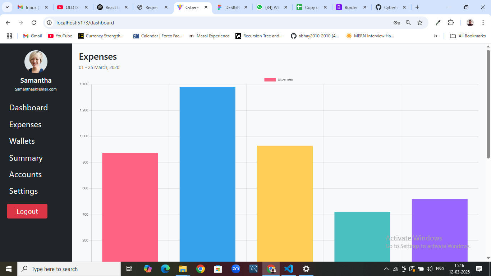

# 📌 CyberHop - Expense Management Dashboard

CyberHop is a modern **Expense Management Dashboard** built using **React, Bootstrap, and Chart.js**. It provides a user-friendly interface to track and visualize expenses effectively.

---

## 🚀 Features
- 🔹 **User Authentication** (Login & Logout)
- 🔹 **Interactive Dashboard with Sidebar Navigation**
- 🔹 **Expense Tracking with Categorization**
- 🔹 **Data Visualization using Charts**
- 🔹 **Responsive UI with Bootstrap**
- 🔹 **Dark & Light Theme Support**

---

## 📸 Screenshots


---

## 🛠 Tech Stack
- **Frontend:** React.js, Bootstrap
- **State Management:** React Hooks
- **Charts:** Chart.js
- **Authentication:** Firebase/AuthContext (if used)
- **Routing:** React Router

---

## 📥 Installation & Setup
git clone https://github.com/<abhay2010-2010>/Cyberhop
cd Cyberhop
npm install
npm run dev

### **1️⃣ Clone the Repository**
```sh
git clone https://github.com/<abhay2010-2010>/Cyberhop
cd cyberhop
